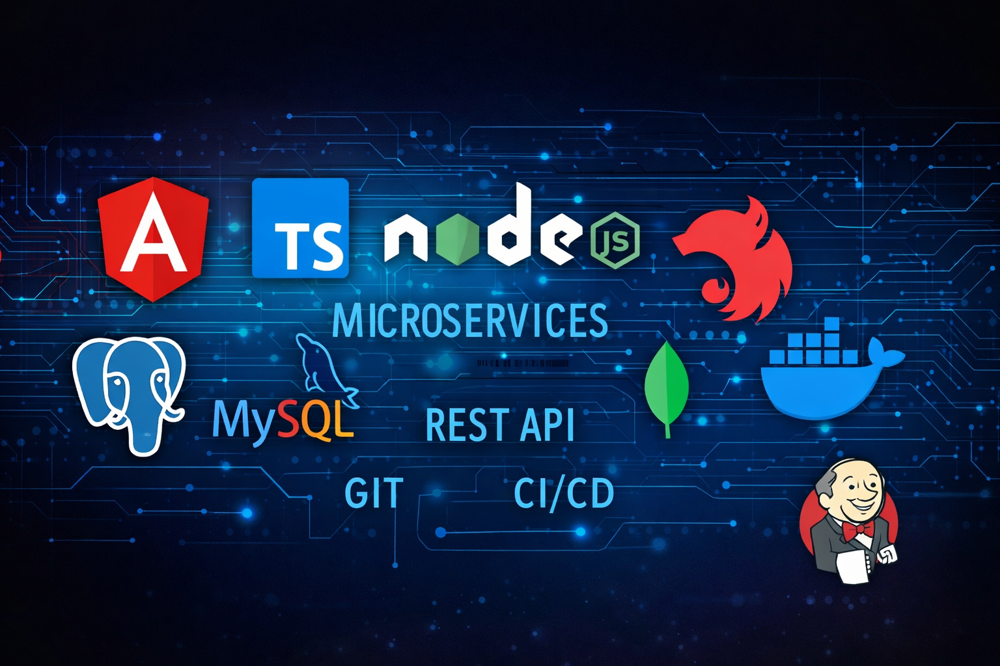

<h1 align="center">Hola, soy Viorel Gil Ruiz</h1>
<h3 align="center">Frontend Angular | Microservicios | Java | Python</h3>

  <a href="./README_EN.md"><b>English Version</b></a>

  

  

  
  
  
  
  

---

## Sobre mi
Soy una persona alegre, comprometida y muy implicada en cada proyecto.
Me gusta trabajar en equipo, aportar ideas y ayudar a que el grupo avance.
Disfruto los retos tecnicos, aprender constante y convertir ideas en productos reales.

## Perfil profesional
- 2 anos de experiencia con Angular en aplicaciones web enfocadas a negocio.
- 2 anos de experiencia trabajando con arquitectura de microservicios y APIs REST.
- Experiencia en backend con Java y Python para servicios escalables y mantenibles.
- Enfoque en calidad de codigo, arquitectura limpia, colaboracion y entrega continua.

## Proyecto destacado
### FitMenu AI Studio
- Plataforma de nutricion inteligente con IA.
- Personalizacion por perfil, login, recomendaciones y menu semanal dinamico.
- Flujo visual moderno y orientado a producto.
- Repo: https://github.com/ViorelGilRuiz/FitMenu

## Stack principal

  

## Carta de presentacion
Busco oportunidades donde aportar valor en frontend y backend.
Me considero un buen companero de trabajo, proactivo y orientado a resultados.
Si tu equipo valora la colaboracion, la calidad tecnica y los retos, encantado de aportar.

## Contacto

  

---

_Abierto a oportunidades donde pueda aportar impacto real en producto y negocio._
