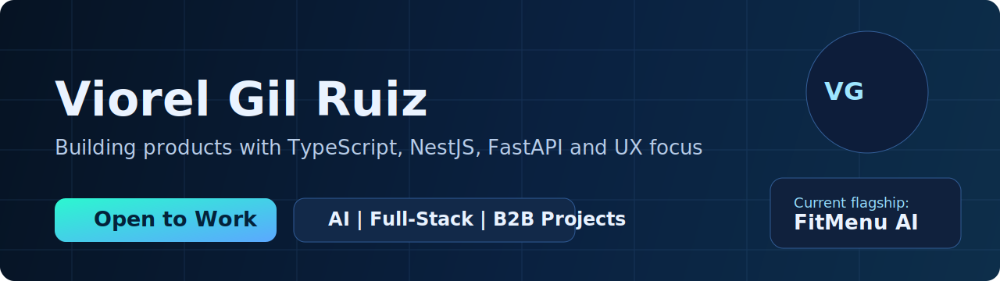

  

# Viorel Gil Ruiz

### Backend Engineer | APIs REST | Microservicios | Java | Python | Angular

<a href="./README_EN.md"><b>English Version</b></a>

 
 

 
 

---

## Perfil profesional

Soy ingeniero de software orientado a producto, con especial foco en **backend, APIs, arquitectura modular y logica de negocio**. Mi perfil combina capacidad full-stack con una base especialmente fuerte para construir servicios, estructurar dominios y desarrollar aplicaciones que resuelven problemas reales de negocio.

Trabajo con una mentalidad muy concreta:

- construir software util, no solo interfaces atractivas
- mantener una estructura limpia y facil de evolucionar
- conectar frontend, backend y base de datos con criterio tecnico
- entregar funcionalidades completas con foco en calidad y claridad

Actualmente estoy especialmente interesado en oportunidades como **Backend Developer** o **Software Engineer con foco backend**, aunque puedo aportar valor real en entornos full-stack cuando el producto lo necesita.

## Lo que aporto a un equipo

- Diseno e implementacion de **APIs REST** claras y mantenibles
- Arquitectura modular por dominios y separacion de responsabilidades
- Backend con **NestJS, Node.js, Java y Python**
- Modelado de datos relacionales con **PostgreSQL, MySQL y Prisma**
- Experiencia conectando frontend Angular con servicios backend robustos
- Mentalidad orientada a producto, mantenibilidad y ejecucion

## Stack principal

  

## Fortalezas tecnicas

### Backend

- Desarrollo de servicios y APIs con NestJS y Node.js
- Implementacion de autenticacion, validacion, guards y organizacion por modulos
- Trabajo con Java y Python para backend y logica de negocio
- Modelado de entidades, relaciones y persistencia con enfoque mantenible
- Arquitectura preparada para crecimiento y evolucion funcional

### Producto y arquitectura

- Capacidad para entender el dominio de negocio y convertirlo en software util
- Diseno de sistemas pensando en escalabilidad, claridad y estructura
- Enfoque pragmatica: priorizar lo que aporta valor real y evita deuda innecesaria
- Buen equilibrio entre ejecucion rapida y base tecnica solida

### Frontend con criterio de integracion

- Angular standalone, TypeScript y estructuras conectadas a APIs reales
- Implementacion de flujos completos de usuario desde la UI hasta la capa de datos
- Capacidad para cerrar features de punta a punta sin perder calidad tecnica

## Proyecto destacado: I Do Manager

**I Do Manager** es una plataforma SaaS modular orientada a wedding planners y clientes finales. Este proyecto representa muy bien mi forma de trabajar porque no esta planteado como una demo aislada, sino como un producto con estructura real, dominio claro y recorrido tecnico.

### Que demuestra este proyecto

- Arquitectura full-stack con **Angular + NestJS + Prisma + PostgreSQL**
- Backend organizado por entidades y dominios de negocio
- Autenticacion, eventos, plantillas y documentos con estructura mantenible
- Modelo de datos claro con `User`, `Business`, `Event`, `Template` y `Document`
- APIs versionadas y base preparada para escenarios SaaS
- Enfoque de producto real: dashboard, editor, timeline, marketplace y flujos operativos

### Por que es relevante para recruiters tecnicos

- Refleja capacidad para construir software de negocio mas alla de ejercicios academicos
- Enseña estructura backend solida y evolucionable
- Muestra pensamiento de arquitectura, no solo implementacion puntual
- Da contexto de producto, dominio y experiencia de usuario dentro de una solucion completa

## Otro proyecto relevante: FitMenu AI

**FitMenu AI** esta orientado a nutricion inteligente y recomendaciones personalizadas. Aporta una segunda linea fuerte a mi perfil porque combina software aplicado, logica funcional y una propuesta de producto clara.

Este tipo de proyectos me interesa especialmente porque me permiten trabajar en:

- logica de negocio real
- autenticacion y flujos de usuario
- recomendaciones y personalizacion
- estructuras backend listas para crecer

## En que tipo de equipos encajo mejor

Encajo especialmente bien en equipos que esten construyendo:

- productos SaaS
- herramientas internas con procesos reales
- plataformas con backend fuerte
- aplicaciones donde la arquitectura y la mantenibilidad importan de verdad

## GitHub overview

  
  

## Contacto

- LinkedIn: [viorel-gil-ruiz-alejos-65810a24b](https://www.linkedin.com/in/viorel-gil-ruiz-alejos-65810a24b/)
- GitHub: [ViorelGilRuiz](https://github.com/ViorelGilRuiz)
- CV: [Ver PDF](https://drive.google.com/file/d/1Lu8suYZvinG1Y29Lo1AaTux_j2-QXcs1/view?usp=sharing)

---

## Resumen rapido para recruiters

Perfil de ingeniero de software con foco backend, capaz de construir soluciones completas con **NestJS, Node.js, Java, Python, Angular y bases de datos relacionales**, siempre con orientacion a producto, estructura mantenible y ejecucion real.
