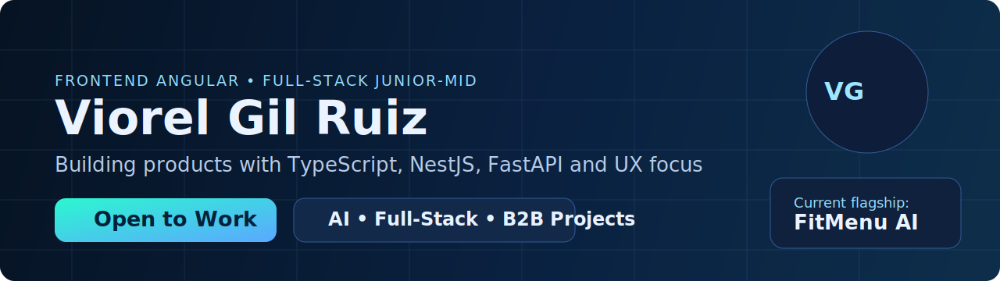

<h1 align="center">Viorel Gil Ruiz</h1>
<h3 align="center">Angular Frontend · Microservices · Java · Python</h3>

  <a href="./README.md"><b>Versión en Español</b></a>

  

  
  
  
  
  

---

## Executive summary
Software engineer focused on product delivery, user experience, and scalable architecture.
I build full-stack solutions with Angular and Java/Python backend services, aligned with business outcomes.

## Value I bring
- Modern Angular frontend with performance and maintainability.
- Microservices and REST API architecture ready for product growth.
- Team-first mindset: collaboration, communication, and ownership.
- Professional delivery: clean code, strong structure, and impact orientation.

## Professional profile
| Area | Experience |
|---|---|
| Frontend | 2 years Angular · 2 years Microservices |
| Backend | Java · Python · REST APIs |
| Soft skills | Teamwork · Initiative · Problem solving |

## Featured project
### FitMenu AI Studio
AI-powered nutrition platform with profile-based personalization, login flow, recommendations, and dynamic weekly planning.

Implemented highlights:
- Redesigned food-themed login UI.
- Week-based dashboard navigation.
- Dynamic AI guidance by day and by week.
- Premium interactions and animations for better UX.

Repo: https://github.com/ViorelGilRuiz/FitMenu

## Tech stack

  

## Contact

  
  

